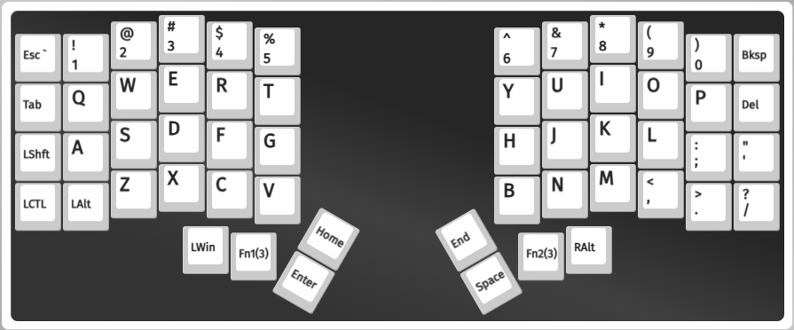
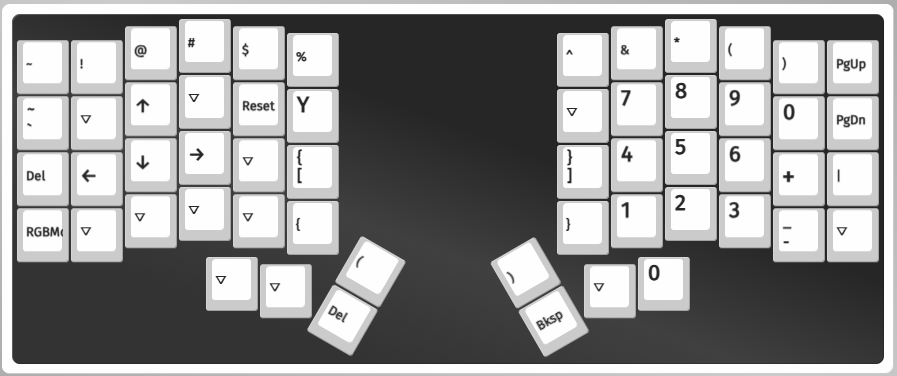
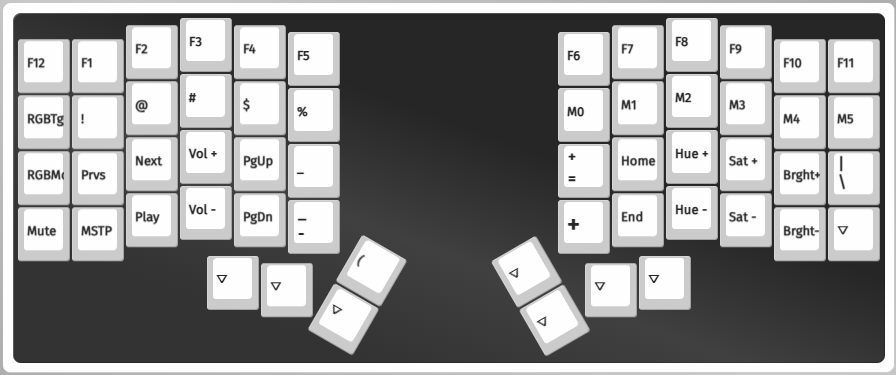

# Iris LM layout

Custom layout with macros for danish characters on US QWERTY.

| Macro | Symbol | alt-code |
| ----- | ------ | -------- |
| M0    | `æ`    | 145      |
| M1    | `ø`    | 0248     |
| M2    | `å`    | 134      |
| M3    | `Æ`    | 146      |
| M4    | `Ø`    | 0216     |
| M5    | `Å`    | 143      |

## Base



Changes from stock

1. B on right hand side
2. LALT moved to left
3. LShift and LCTL swapped

## Layer 1



Changes from stock

1. Space changed to backspace for easier access.

## Layer 2



Changes from stock

1. Danish characters via macros typing in alt codes

## Macros

If you only need the macros for your layout then simply copy the macros from the json file into your own file and load it.

```json
  "macros": [
    "{KC_LALT,KC_P1,KC_P4,KC_P5}",
    "{KC_LALT,KC_P0,KC_P2,KC_P4,KC_P8}",
    "{KC_LALT,KC_P1,KC_P3,KC_P4}",
    "{KC_LALT,KC_P1,KC_P4,KC_P6}",
    "{KC_LALT,KC_P0,KC_P2,KC_P1,KC_P6}",
    "{KC_LALT,KC_P1,KC_P4,KC_P3}",
    "",
    "",
    "",
    "",
    "",
    "",
    "",
    "",
    "",
    ""
  ],
```

## VIA

https://usevia.app/
